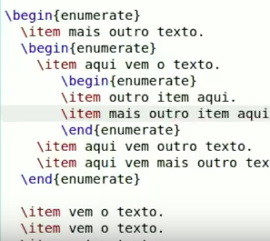
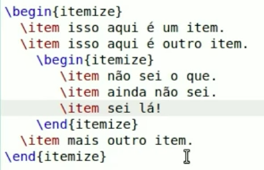
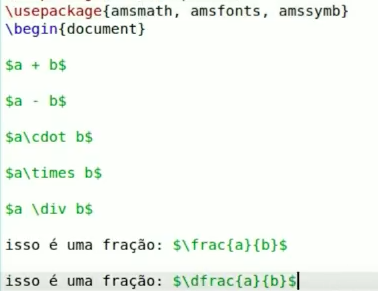
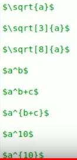
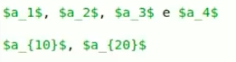
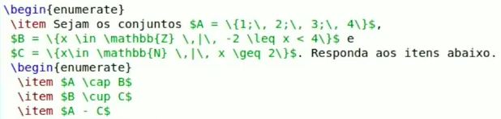
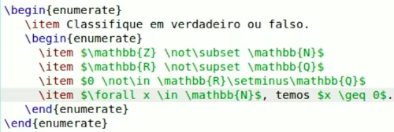

# latex-journey

> Aprendendo LaTeX

## Links

Primeiros passos no LaTeX: [http://posgraduando.com/introducao-ao-latex-os-primeiros-passos/](http://posgraduando.com/introducao-ao-latex-os-primeiros-passos/)

Video aulas sobre LaTeX: [https://www.youtube.com/watch?v=4pTf8vB9Ezg](https://www.youtube.com/watch?v=4pTf8vB9Ezg)

Editor LaTeX on line: [https://pt.sharelatex.com/](https://pt.sharelatex.com/)

Apresentação de LaTeX

[Click para carregar a Apresentação de LaTeX em PDF](docs/latex-curso.pdf)

## Instalando LaTeX

### Debian sob Docker

Instalando o TeXlive

```bash
RUN apt-get update && apt-get install -y --no-install-recommends texlive && \
    ls -la /usr/bin | grep texlive
```

O TeX Live instala os seguintes executáveis:
```
allcm -> /usr/share/texlive/texmf-dist/scripts/texlive/allcm.sh
allneeded -> /usr/share/texlive/texmf-dist/scripts/texlive/allneeded.sh
dvi2fax -> /usr/share/texlive/texmf-dist/scripts/texlive/dvi2fax.sh
dvired -> /usr/share/texlive/texmf-dist/scripts/texlive/dvired.sh
fmtutil -> /usr/share/texlive/texmf-dist/scripts/texlive/fmtutil.pl
fmtutil-sys -> /usr/share/texlive/texmf-dist/scripts/texlive/fmtutil-sys.sh
ht -> /usr/share/texlive/texmf-dist/scripts/tex4ht/ht.sh
htcontext -> /usr/share/texlive/texmf-dist/scripts/tex4ht/htcontext.sh
htlatex -> /usr/share/texlive/texmf-dist/scripts/tex4ht/htlatex.sh
htmex -> /usr/share/texlive/texmf-dist/scripts/tex4ht/htmex.sh
httex -> /usr/share/texlive/texmf-dist/scripts/tex4ht/httex.sh
httexi -> /usr/share/texlive/texmf-dist/scripts/tex4ht/httexi.sh
htxelatex -> /usr/share/texlive/texmf-dist/scripts/tex4ht/htxelatex.sh
htxetex -> /usr/share/texlive/texmf-dist/scripts/tex4ht/htxetex.sh
kpsetool -> /usr/share/texlive/texmf-dist/scripts/texlive/kpsetool.sh
kpsewhere -> /usr/share/texlive/texmf-dist/scripts/texlive/kpsewhere.sh
mk4ht -> /usr/share/texlive/texmf-dist/scripts/tex4ht/mk4ht.pl
mptopdf -> /usr/share/texlive/texmf-dist/scripts/context/perl/mptopdf.pl
pdfatfi -> /usr/share/texlive/texmf-dist/scripts/oberdiek/pdfatfi.pl
simpdftex -> /usr/share/texlive/texmf-dist/scripts/simpdftex/simpdftex
texdoc -> /usr/share/texlive/texmf-dist/scripts/texdoc/texdoc.tlu
texdoctk -> /usr/share/texlive/texmf-dist/scripts/texdoctk/texdoctk.pl
thumbpdf -> /usr/share/texlive/texmf-dist/scripts/thumbpdf/thumbpdf.pl
tlmgr -> /usr/share/texlive/texmf-dist/scripts/texlive/tlmgr.pl
updmap -> /usr/share/texlive/texmf-dist/scripts/texlive/updmap.pl
updmap-sys -> /usr/share/texlive/texmf-dist/scripts/texlive/updmap-sys.sh
```

Os comandos abaixo são os mais utilizados:

* tlmgr - Usado para gerenciar a distribuição de pacotes no TeX


## Excutando o Contêiner Docker

```bash
docker run -v $PWD/work:/tex/data  -i -t parana/textlive bash
``` 

No contêiner execute:

```bash
do-latex artigo-1 ## Isto compila artigo-1.tex gerando /tex/data/out/artigo-1.pdf
```
Assim podemos visualizar no host assim: `open work/out/artigo-1.pdf`

Coloque seus arquivos text em `work/in`. O resultado será movido para `work/out`

## Resolução de Problemas

**Problema:**

Font OT1/pcr/m/n/10=pcrr7t at 10.0pt not loadable: Metric (TFM) file not found. \maketitle

**Solução:**

```bash
tlmgr search --file pcrr7t.tfm --global
```

```
tlmgr: package repository http://linorg.usp.br/CTAN/systems/texlive/tlnet (verified)
courier:
  texmf-dist/fonts/tfm/adobe/courier/pcrr7t.tfm
```

```bash
sudo tlmgr install courier
```

Repita para `phvr7t.tfm`

```bash
tlmgr search --file phvr7t.tfm --global
sudo tlmgr install helvetic
```

## Usando o pacote `texliveonfly`

```bash
texliveonfly artigo-1.tex
```

## Usando a Linguagem TeX

Veja os [videos do professor Aquino](https://youtu.be/F-yGTt9Bty4?list=PLa_2246N48_p9ndUHlO255uvKtSR8mshE) no YouTube

Abaixo um resumo.

#### Listas





#### Operadores e frações



#### Potências e Raizes



#### Indices para enumerados



#### Teoria de Conjuntos





